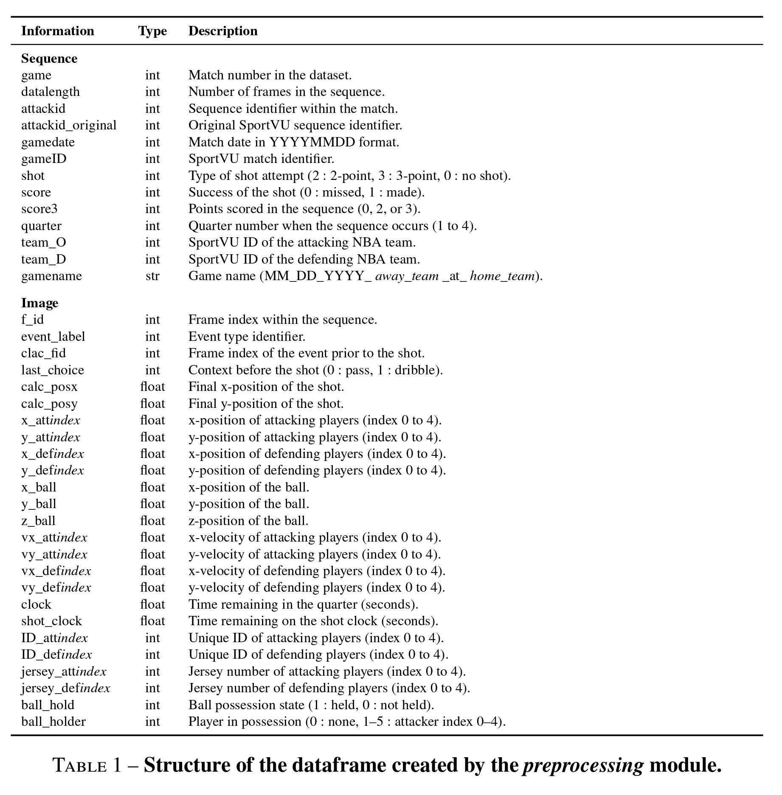

# Space data in Basketball 🏀
[](https://openstarlab.readthedocs.io/en/latest/Pre_Processing/Sports/index.html)

# PreProcessing Script

This script allows you to download and preprocess [SportVU NBA](https://drive.google.com/drive/folders/1mJaYJ7xJ95XoBD0LJXhIInSNp_Y_c-pq) tracking data (modification of [BasketballData](https://github.com/rajshah4/BasketballData)) using the `Space_data` classes.

---
## Dataframe information


Event labels ID:
```python
EVENT_LABELS = {
    'nonevent': 0,
    'pass': 1,
    'catch and pass': 2,
    'handoff catch and pass': 3,
    'catch': 4,
    'handoff pass': 5,
    'handoff catch and handoff pass': 6,
    'catch and handoff pass': 7,
    'handoff catch': 8,
    '2 point shot': 9,
    '3 point shot': 10,
    'turnover': 11
}
```

## Example Usage

```python
from preprocessing import Space_data

# Indicate the folder where you want download the data
data_path = "path/to/folder"

# For downloading the data
Space_data(data_provider="SportVU_NBA", data_path= data_path).download_data()

# For reshaping the data
basket_df = Space_data(data_provider="SportVU_NBA", data_path= data_path).preprocessing(nb_process_game = 4)
```
